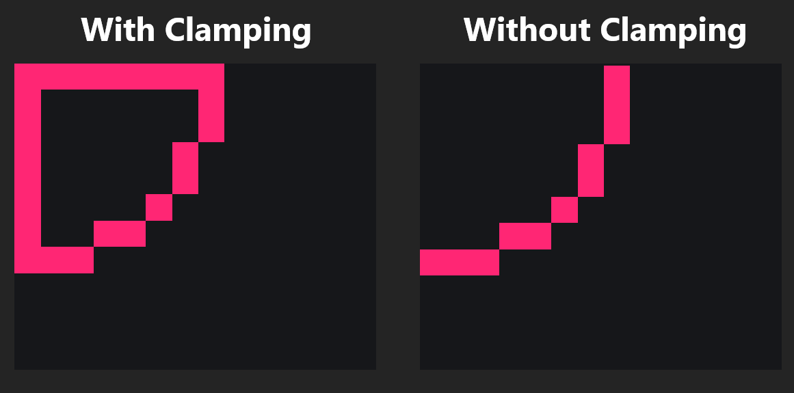

## Installation

1. Clone the repository:
   ```sh
   git clone https://github.com/DominikKoperkiewicz/Pixel-Mat-Simulator.git
   cd Pixel-Mat-Simulator
   ```

2. Run the simulation:
   ```sh
   node .
   ```

## Usage
Once you run `node index.js`, the matrix display will appear in the terminal, and points will start animating in a circular motion.

### Adding a New Circle
To add a new circle, modify `index.js` and instantiate a new `CircleAnimation` object:
```js
const circleThree = new CircleAnimation(matSimulator, 10, 5, 3);
```
- `matSimulator`: The mat simulator instance.
- `10, 5`: The initial center position `(x, y)` of the circle.
- `3`: The radius of the circular motion.

## Project Structure
```
MatSimulator/
│── index.js           # Entry point of the simulator
│── MatSimulator.js    # Matrix rendering and update logic
│── CircleAnimation.js # Circular motion animation logic
│── README.md          # Project documentation
```

## Documentation
### `MatSimulator`
This class is responsible for rendering and updating the matrix in the terminal.

#### Constants:
- `FRAME_DURATION`: frame interval length in milliseconds (default: 100ms).

#### Methods:
- `printMat()`: Prints the matrix state in the terminal.
- `turnOnTile(x, y)`: Turns on a specific tile (pixel) at `(x, y)`.
- `turnOffTile(x, y)`: Turns off a specific tile at `(x, y)`.

### `CircleAnimation`
Handles the movement of a point in a circular trajectory.

#### Constructor:
```js
new CircleAnimation(matSimulator, circleX, circleY, radius);
```
- `matSimulator`: The matrix simulator instance.
- `circleX`, `circleY`: The center of the circle.
- `radius`: The radius of the circle.

#### Methods:
- `update()`: Updates the position of the point moving in a circular path.

#### Clamping
By default when point goes outside designated area, it snaps to the wall. You can turn it off by deleting/commenting appropriate lines in `update()` implementation. 


